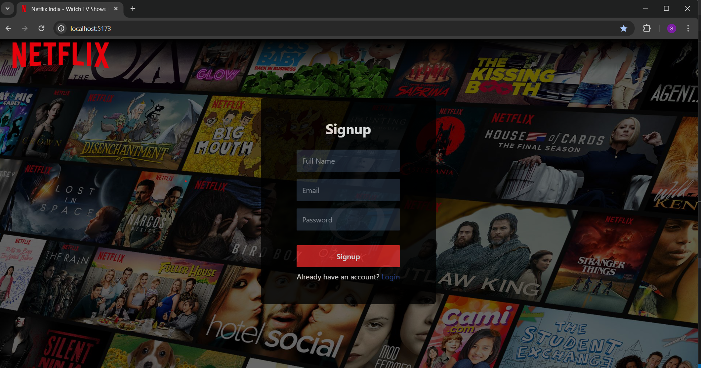
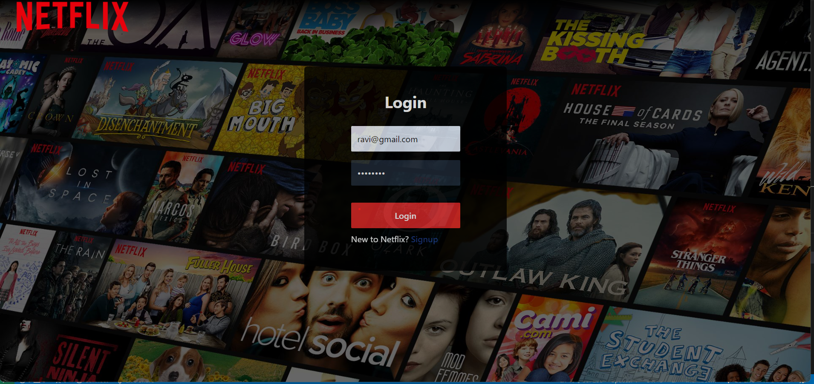
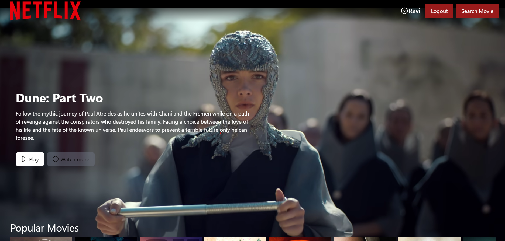
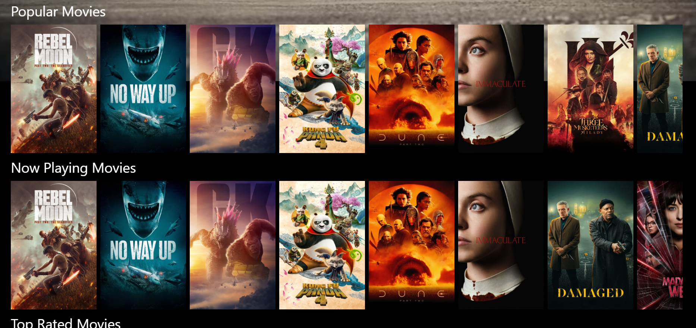
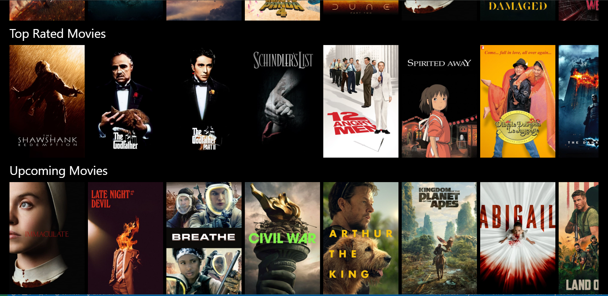
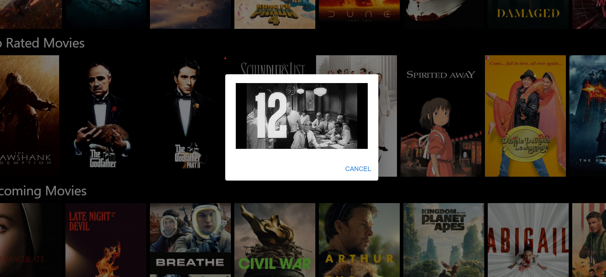
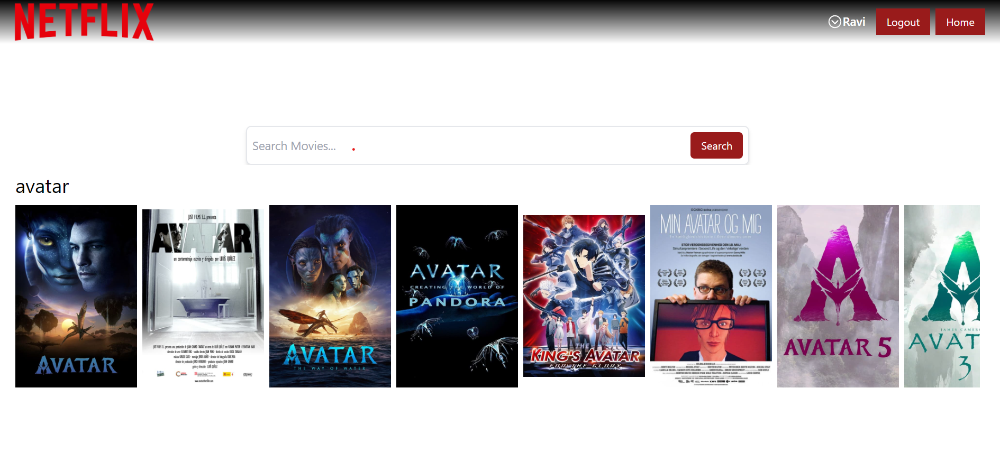

# Netflix Clone

This is a Netflix clone project that allows users to browse and watch movies. It includes features like user authentication, browsing popular, now playing, top-rated, and upcoming movies, searching for movies, and playing trailers.

## Project Image

### Signup Page



### Login Page



### BrowsePage



### MovieList



### MovieList2



### AfterPlay



### SearchPage




## Project Live Demo

- Check out the live demo of the Netflix-Clone [here](https://netflix-clone-frontend-blush.vercel.app/).

## Important Notice: Movie Poster Loading Issue

### Overview
When using our application, you may encounter difficulties loading movie posters due to occasional issues with the Movie Database (TMDb) website. To ensure seamless poster loading on your desktop or laptop, we recommend configuring your network settings as follows:

### Steps to Configure Network Settings:

1. **Open Control Panel:** Access the Control Panel on your system.
   
2. **Navigate to Network and Internet:** Click on "Network and Internet" settings.
   
3. **Access Network and Sharing Center:** Proceed to the "Network and Sharing Center."
   
4. **Select Your Wi-Fi Connection:** Locate and click on your Wi-Fi connection.
   
5. **Access Connection Properties:** Click on "Properties" for your selected connection.
   
6. **Configure DNS Settings**:
   - Locate "Internet Protocol Version 4 (TCP/IPv4)" and click on it.
   - Select "Use the following DNS server addresses."
   - Enter the following DNS server addresses:
     - Preferred DNS server: 8.8.8.8
     - Alternate DNS server: 8.8.0.0

By following these steps, you can optimize your network settings to enhance the reliability of movie poster loading within our application.

Should you have any further queries or encounter any difficulties, please don't hesitate to [contact me](saurabh7411sharma@gmail.com) for assistance.

Thank you for your understanding and cooperation.


## Table of Contents

1. [Installation](#installation)
2. [Usage](#usage)
3. [Features](#features)
4. [Backend](#backend)
5. [Frontend](#frontend)
6. [Technologies Used](#technologies-used)
7. [Contributing](#contributing)


## Installation

To run this project locally, follow these steps:

1. Clone the repository:

- Frontend Clone

```bash
git clone https://github.com/Saurabh-Sharma-1999/NetflixClone_Frontend.git
```
- Backend Clone

```bash
git clone https://github.com/Saurabh-Sharma-1999/NetflixClone_Backend.git
```


2. Navigate to the backend directory:

```bash
cd backend
```
3. Install dependencies:

```bash
npm install
```

4. Set up environment variables:
- Create a '.env' file in the backend directory.
- Add the following variables:

```bash
PORT=
ATLAS_URL=
SECRET=
```

5. Start the backend server:

```bash
node index.js
```

6. Navigate to the frontend directory:

```bash
cd ../frontend
```

7. Install dependencies:

```bash
npm install
```

8. Start the frontend application:

```bash
npm run dev
```

## Usage

Once the backend and frontend servers are running, you can access the Netflix clone application by navigating to http://localhost:5173/ in your web browser.

## Features

- User Authentication: Users can register, login, and logout.
- Browse Movies: Users can browse popular, now playing, top-rated, and upcoming movies.
- Search Movies: Users can search for movies.
- Watch Trailers: Users can watch trailers of movies.

## Backend

The backend of this project is built using Node.js and Express.js. It includes routes for user authentication (register, login, logout) and fetching movie data from The Movie Database (TMDb) API. It uses MongoDB Atlas for data storage.

## Frontend

The frontend of this project is built using React.js. It includes components for the user interface, such as login, registration, browsing movies, searching movies, and playing trailers. It utilizes Redux for state management and React Router for navigation.

## Technologies Used

- Backend: Node.js, Express.js, MongoDB Atlas
- Frontend: React.js, Redux, React Router
- API: The Movie Database (TMDb) API
- Other: Axios, React Icons, Material-UI

## Contributing

Contributions to this project are welcome. Feel free to open issues and pull requests to suggest features, report bugs, or make improvements.

## Thank You

Thank you for checking out this Netflix clone project! If you have any questions, suggestions, or feedback, feel free to [open an issue](https://github.com/Saurabh-Sharma-1999/NetflixClone_Frontend/issues) or [contact me](saurabh7411sharma@gmail.com). Happy coding!


